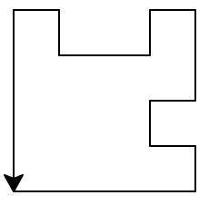
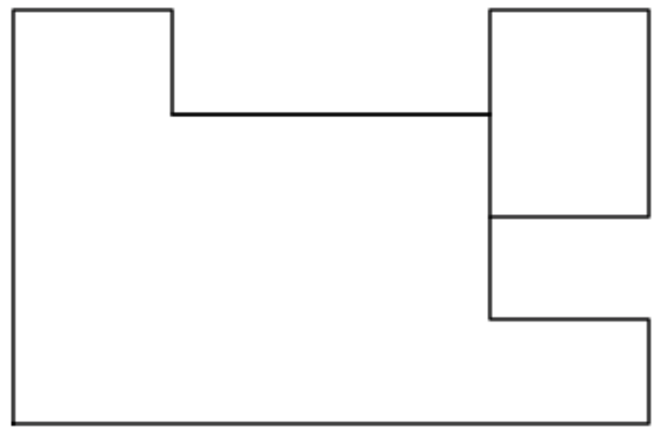
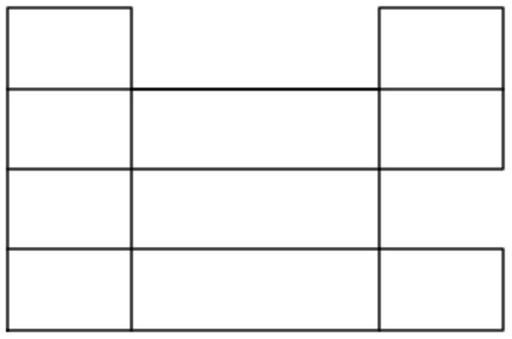

#Partitioning of Rectilinear Polygons 
---

#####INPUTS
 **_G_** = Rectilinear Graph
 **_X_** = Set of Abscissa of vertices
 **_Y_** = Set of Ordinates of vertices
 **_Collinear\_Vertices_** = Set of Collinear Vertices[^0]
 **_Concave\_Vertices_** = Set of Concave Vertices[^1]
 **_Horizontal\_Chords_** = Set of Horizontal Chords[^2]
 **_Vertical\_Chords_** = Set of Vertical Chords[^2]

---

*__Method of Labelling the graph__* 
We take inputs of vertices from cursor keys, i.e., up(↑), left(→), and right (←). As input is read, the pointer proceeds forward and draws a rectillinear polygon with its trail. The labelling of the vertex starts from v<sub>0</sub> and goes upto v<sub>n-1</sub>, where _n_ is the _number of vertices in the polygon_. 

<br><br><br><br>
###### Rectillinear polygon traced by Pointer  
Pressing a key once means going forward, left[^-1], or right[^-1]. A distance of only one unit can be traversed one at a time.

**EXAMPLE**
In the above figure, the pointes is shown by a small arrow.
Total number of vertices = 20
Collinear\_Vertices = [v<sub>1</sub>, v<sub>2</sub>, v<sub>3</sub>, v<sub>9</sub>, v<sub>13</sub>, v<sub>17</sub>, v<sub>18</sub>, v<sub>19</sub>]
Concave\_Vertices = [v<sub>6</sub>, v<sub>7</sub>, v<sub>12</sub>, v<sub>14</sub>]

###_**Algorithm for Finding Maximum partitions**_


#####STEP I

```python
max_partition(G):
    for u in Concave_Vertices:
        for v in Concave_Vertices and v > u+1:
            if exists a chord joining v & u and ~exists another concave 
             vertex on chord joining v & u:
                if chord is horizontal: 
                    add (v, u) to Horizontal_Chords
                else if chord is vertical:
                    add (v, u) to Vertical_Chords
            else :
                loop_back
```

**_Task Achieved:_** All the edges that exist between *any two concave vertices* are being added to their *respectful categories*.
**_Example: _** <br>

<br><br><br><br>
*Horizontal\_Chords* =  ∅
*Vertical\_Chords*  =  [(v<sub>7</sub>, v<sub>12</sub>)]

<u>*Explanation*</u>:
**u > v :** Comparison between two vertices is done on the basis of their respective vertex indices[^3].
Here **_v-u_** should be greater than unity, because this assures the vertex v is not consecutive to u and has a higher index than u. Thus, iteration through each pair of vertex is done only once, making it more efficient.

In the above code, we iterate through all (concave vertex, convex vertex') pairs, and check for existence of vertical and horizontal chords, that are not intersected by any other vertex.
We observe that, v<sub>7</sub> and v<sub>12</sub> are the only two concave vertices and between whom, there exists a vertical chord. Therefore, it is added to the set of *Vertical\_Chords*. Also, there does not exist any chord horizontal chord between any concave vertices and therefore, set of *Horizontal\_Chords* is empty.

#####STEP II

```python
    for u in Collinear_Vertices:
        for v in Concave_Vertices:
            if exists a chord joining v & u and ~exists another concave 
                or collinear vertex on chord joining v & u:
                if chord is horizontal:
                    add (v, u) to Horizontal_Chords
                else if chord is vertical:
                    add (v, u) to Vertical_Chords
            else :
                loop_back
```

**_Task Achieved:_** All the chords between *collinear vertices and concave vertices* are being added to their *respective categories*.

**_Example: _** <br>



<br><br><br><br>
*Horizontal\_Chords* =  [(v<sub>9</sub>, v<sub>12</sub>), (v<sub>17</sub>, v<sub>14</sub>), (v<sub>18</sub>, v<sub>7</sub>), (v<sub>19</sub>, v<sub>6</sub>)]
*Vertical_Chords* =  [(v<sub>7</sub>, v<sub>12</sub>), (v<sub>1</sub>, v<sub>4</sub>), (v<sub>3</sub>, v<sub>6</sub>)]

<u>*Explanation*</u>:
In the above code, we iterate through all (collinear vertex, convex vertex) pairs, and check for existence of vertical and horizontal chords between them, that are not intersected by any other vertex.
If any chord is found, it is added to set of *Vertical\_Chords* or *Horizontal\_Chords*, depending on its orientation.
Thus, we have found all the chords, and only need to plot them now.

```python
    plot(X,Y)
    plot(Horizontal_Chords)
    plot(Vertical_Chords)
    display(plot)
```
[^-1]: Left and Right operation also changes the direction the pointer faces/poitns.
[^0]: Vertices that are induced after going forward consecutively. Although in the example, they are not explicitly shown, but they do exist and at a distance of one unit from its previous vertex.
[^1]: If the interior angle made by the two edges incident at this vertex is 270 degree.
[^2]: Chords are lines joining two vertices which are not already part of the polygon.
[^3]: As, the way of labelling is defined, there is unique labelling of each rectillinear polygon.